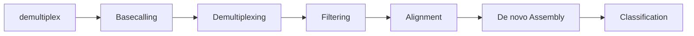

# NanoMetaPipe
## Overview
- This pipeline was conceived as part of the Sulawesi metagenomics project by Dr Janet Cox-Singh. 
- The pipeline is designed to take enable a researcher to take their raw nanopore sequenced microbiome data through to classification.
- The simplified pipeline breakdown is:

- IMPORTANT: This pipeline is designed to be run on a medium to large high performance cluster. This is particularly the reason why the basecalling step is separated from the remainder of the pipeline.
	- The rationale behind this is that GPU nodes are often sectioned off to specific nodes on a HPC and we are trying to be good HPC citizens
	- Hence the basecalling which requires a GPU will be run on the GPU node so as not to clog up the GPU node for the entire run of this pipeline
- Another important note: This pipeline was developed with both DNA and double stranded cDNA sequences and thus attempts to cater for both instances

# Scripts and workflow for the Sulawesi Microbiome Project
- Scripts are written in python mainly with satelite scripts in bash and R