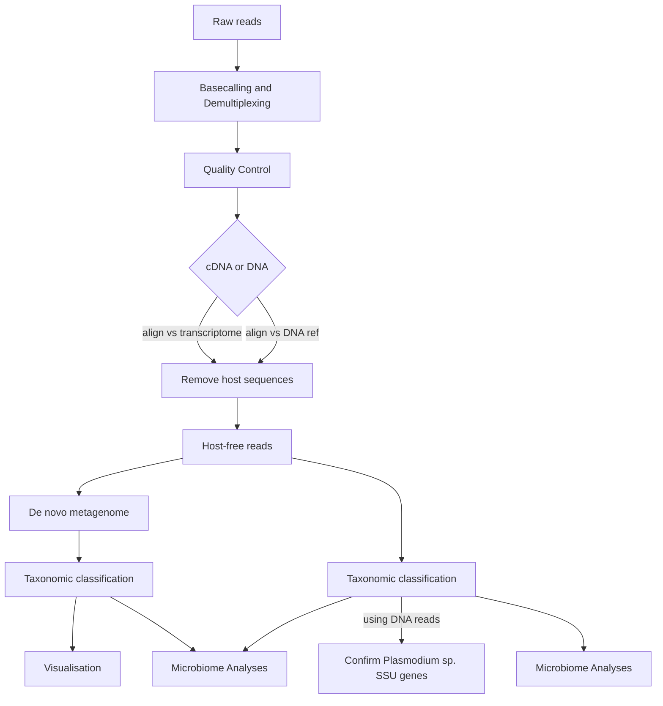

# NanoMetaPipe
## What is NanoMetaPipe
NanoMetaPipe is a bespoke pipeline conceived as part of the Sulawesi metagenomics project by Dr Janet Cox-Singh and Dr Fauzi Muh. This pipeline has been developed by Dr D.R. Oresegun with aid from Dr Peter Thorpe -- both of the University of St Andrews. 
The pipeline is designed to enable a researcher to take raw nanopore sequence microbiome data through to taxonomic classification and subsequent visualisation of this classification
The simplified pipeline is: 

### IMPORTANT THINGS TO NOTE:
- This pipeline is designed to be run on a medium to large high performance cluster (**HPC**). This is particularly the reason why the basecalling step is separated from the remainder of the pipeline. 
	- The rationale behind this is that GPU nodes are often sectioned to specific access nodes on a HPC -- *and we are trying to be good HPC citizens*
	- Hence the basecalling which requires a GPU will be run on a GPU access node so as not to clog up the GPU node once the basecalling is completed
- This pipeline was developed with both DNA and double stranded cDNA **Nanopore long-read** sequences and thus attempts to cater for both instances.
	- **While there is support for the use of double stranded cDNA, currently, it may not provide sufficient information.**
## Installation
The full list of tools used for this pipeline are mostly available via conda. The full list is:
[nanometapipe_tools.csv](https://github.com/damioresegun/Sulawesi_microbiome/files/10268770/nanometapipe_tools.csv)

- This pipeline has 4 main branches:
	1. **Basecalling**
	2. **Processing, Analyses, Classification**
	3. **Microbiome Analysis**
	4. **Classification confirmation**
- Branches **2-4** were developed using separate scripts and thus separate **conda** environments!
- **It is recommended to use the R scripts in a GUI environment rather than through the command line. We recommend the use of RStudio**
### Databases
To carry out the necessary classification and confirmation, databases are required. 
- Taxonomic classification is carried out using the full RefSeq *nr* whole genomes for all:
	- Archaea
	- Bacteria
	- Fungi
	- Protozoa
	- Plants
	- Plasmids
	- Virus
Classification confirmation is carried out using the reference **SILVA** database **or** a curated/custom SILVA database
### Full Installation
For full installation instructions, please go to the [[Installation]] page. This page will provide full scope information of the necessary steps required to install the tools and packages utilised in NanoMetaPipe.
## Quick Start
The quickest way to start the pipeline is the use of the `runMetaPipe.sh` script. The pipeline is set up to run an entire ONT sequencing **experiment** run in one go. This means that the absolutely first thing that is necessary are raw outputs of a ONT sequencing experiments that still require basecalling. 
### Basecalling
Basecalling is carried out using the `NanoMetaBasecall.py` script. This script **ONLY** carries out basecalling. To run the script: 
```bash
python NanoMetaBasecall.py -p path/to/guppy/bin/guppy_basecaller -r path/to/raw/fast5/files -o path/to/output/folder -m hac -k SQK-LSK109 -f FLO-MIN110
```
The options used represent:
- `-p`: The **direct** full path to the guppy basecaller tool **within** the guppy package
- `-r`: The full path to the raw sequence reads in FAST5 (or equivalent) format
- `-o`: The full path to the output directory to place the basecalled results. 
	- *Note: The script creates a 'Basecalled' folder within the designated output folder*
- `-m`: The basecalling algorithm to be used. Can be `hac` or `sup`
- `-k`: The sequencing kit used for the experiment
- `-f`: The flowcell used for the experiment
### Main Pipeline -- NanoMetaPipe
The bulk of the pipeline is carried out using the `NanoMetaPipe.py` script. For full instructions of how to run this script, go to: [[Pipeline Breakdown]]. For a quick run, open the `runMetaPipe.sh` and provide the information for the required variables
| Variable      | Information needed                                                           |
| ------------- | ---------------------------------------------------------------------------- |
| NanoMetaPipe  | Full path to the NanoMetaPipe.py script                                      |
| reference     | Full path to the reference genome for removing host/background contamination |
| basecalled    | Full path to the basecalled reads/outputs of the NanoMetaBasecall.py         |
| barcodes      | List of barcodes used for sequencing                                         |
| isolates      | List of isolates that were sequenced. Must be unique identifiers             |
| kraken        | Full path to the kraken package                                              |
| kraken_DB     | Full path to the kraken database                                             |
| sequence_type | Type of sequence data. Can be `dna` or `cdna` or `both`                            |
| bracken       | Full path to the bracken package                                             |
| ncbi_db       | Full path to the local NCBI *nt* database                                      | 

These are the bare minimum options required to run the main NanoMetaPipe pipeline. Further options are available in the [[Pipeline Breakdown]] page or with `python NanoMetaPipe.sh --help`.
To run the `runMetaPipe.sh` script after inputting the necessary options:
```bash
# first activate the correct conda environment named 'nanometaENV'
conda activate nanometaENV
# first allow the script to be executable
chmod +x runMetaPipe.sh
# then run the script
./runMetaPipe.sh
```
Further optional arguments are available to provide considerable manipulation of the pipeline and the processes held within.
### Secondary Pipeline -- Classification confirmation
These steps were developed using the *small subunit ribosomal RNA* hence why it has been named `SSU_rRNA.py`. 
To run the script, you need:
1. Filtered and clean reads
2. Decide whether to create a hidden markov model (HMM) profile within the script. **OR**
	2b. Provide a previously generated HMM profile
3. An output directory
4. A database to compare against for identification
To run the script with a *previously generated profile*:
```bash
# activate the correct conda environment name 'hmmENV'
conda activate hmmENV
# run the SSU script with a previously generated profile
python ./SSU_rRNA.py -f full/path/to/reads.fasta -m run -o path/to/output -db path/to/SILVA/database
```
To first generate a HMM profile before confirmation is carried out:
```bash
# activate the correct conda environment name 'hmmENV'
conda activate hmmENV
# run the SSU script to create a new HMM profile
python ./SSU_rRNA.py -f full/path/to/reads.fasta -m create -o path/to/output -db path/to/SILVA/database
```
Once again, for full options of the script, go to [[Pipeline Breakdown]].
### Secondary Pipeline -- Microbiome Analysis
This R script is developed to be run within a graphical R interface. This is recommended to be run in RStudio. 
**The script must be run after completing the main NanoMetaPipe pipeline. An output from NanoMetaPipe is required to run this R script.**
Open the the `sampleData.csv` file and populate it with metadata about your samples. 
To run the `MicrobiomeAnalysis.R`, open the script in RStudio and fill in the necessary information in the **args** variable. An example is below:
```r
# set the argument
args = c("path/to/NanoMetaPipe/output/CombinedIsolate.biom",
		"path/to/output/folder/that/already/exists",
		"path/to/sample_metadata.csv")
```
## Outputs
- **Basecalling:** outputs are in the form of basecalled reads, that are saved in a `Basecalled` folder in the output path you provided
- **runMetaPipe.sh** and **NanoMetaPipe:** various outputs are generated
	- **Assemblies:** contains the generated metagenome from the experiments **ONLY**. Works for both DNA and dscDNA
	- **cDNA_Processing:** contains a generated transcriptome and/or the alignment of the dscDNA sequence reads against a transcriptome to remove host/contaminant transcriptome
	- **Demultiplexed:** contains gzipped FASTQ files of the raw demultiplexed barcodes
	- **DeNoVo_Assembly:** contains the full outputs of the denovo metagenome process
	- **Filter_Demultiplexed:** contains length and quality filtered demultiplexed reads for the stated barcodes used during sequence preparation
	- **Host_Free_Reads:** contains reads which do not map to the reference that were extracted and saved as FASTQ files
	- **Isolate_Reads_Aligned_Vs_Reference:** contains the BAM file of the DNA reads vs the contaminant reference genome
	- **Kraken:** contains the taxonomic classification outputs of the reads and metagenomes. Visualisations are saved in HTML files
	- **Stats:** contains various outputs of basic and in-depth statistical tests for the reads and metagenomes
	- **error.log:** An error log. Will be empty if no errors occur
	- **logINFO.log:** A truncated log file of the most important processing steps of the pipeline
	- **logfile.txt:** A full log file of all processing steps and messages of the pipeline

## Contributors
The pipeline has been developed by D.R. Oresegun with input from Peter Thorpe for the Sulawesi capacity building project implemented by Janet Cox-Singh. 

## Contact
If issues arise from the use of this pipeline, open an issues and I will attempt to help with troubleshooting
